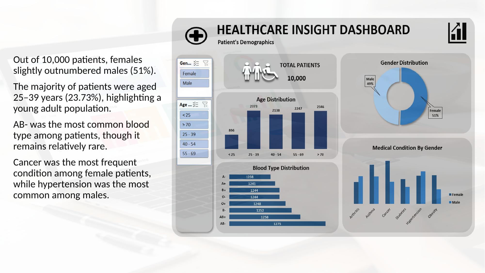
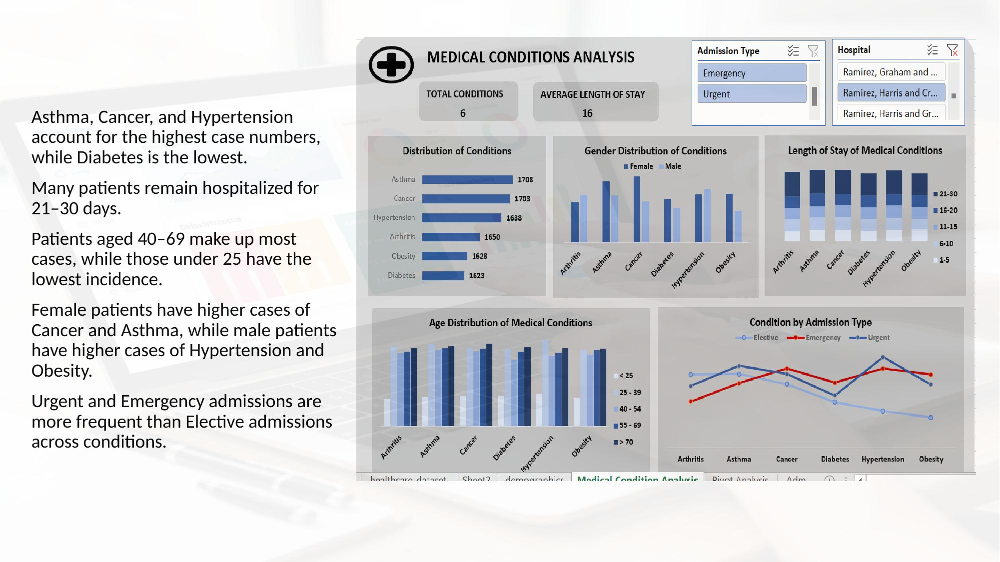
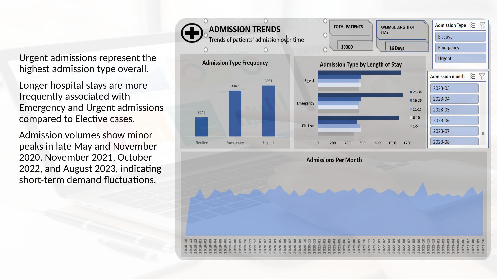
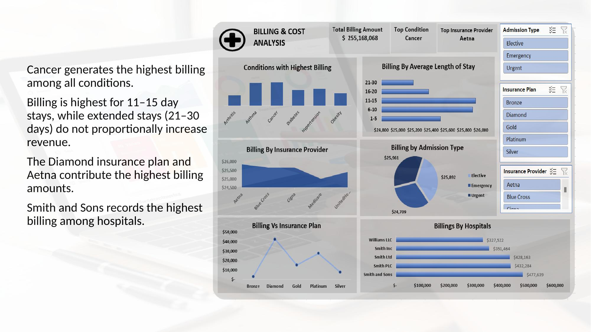
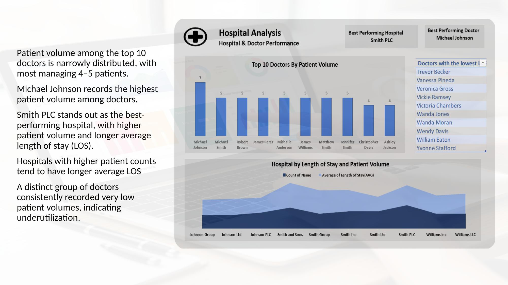
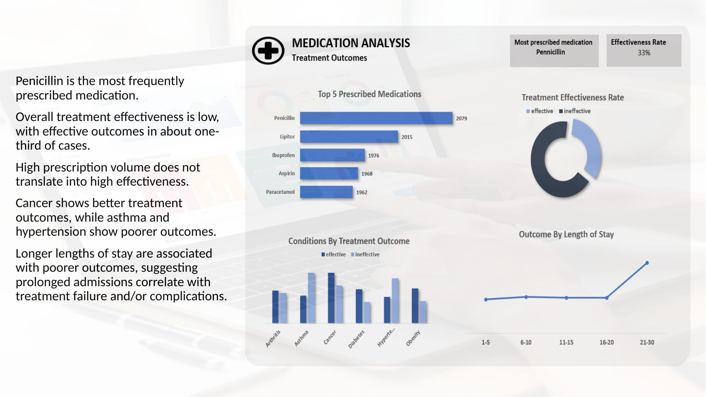

# 🏥 AHA! Healthcare Insights
### Analyzing Patient Trends and Hospital Care in the Aha Region

**Tools:** Microsoft Excel · Pivot Tables · Dashboard Design · Data Cleaning  
**Author:** Tiwa Daodu  
**Domain:** Healthcare Analytics · Business Intelligence  
**Project Type:** DataLab Analytics Internship Project

---

## 📌 Project Overview

This project analyzes **10,000 patient records** spanning November 2018 to November 2023 from hospitals in the Aha region. Using Microsoft Excel exclusively — from raw data cleaning through to interactive dashboards — the analysis uncovers actionable patterns in patient demographics, medical conditions, billing, and hospital performance.

**Key Questions Answered:**
- Which demographics are most affected by specific medical conditions?
- How do admission types and lengths of stay vary across conditions?
- What drives billing costs, and which hospitals perform best?
- How effective are current treatment regimens?

---

## 🧹 Data Preparation

The raw dataset contained patient demographics, medical records, billing data, and hospital information. The following transformations were applied entirely in Excel:

| Task | Method |
|------|--------|
| Age grouping | Helper column with `IF`/`IFS` binning into ranges (< 25, 25–39, etc.) |
| Length of Stay | Calculated as `Discharge Date − Admission Date` |
| LOS Categories | Categorical bins (1–5, 6–10, 11–15, 16–20, 21–30 days) |
| Treatment Effectiveness | Classified test results into "Effective" / "Ineffective" |
| Billing Tiers | Grouped billing amounts into Bronze → Diamond categories |

---

## 📊 Dashboards

### Dashboard 1 — Patient Demographics


**Highlights:**
- 10,000 total patients; females slightly outnumber males (51% vs 49%)
- Largest age group: 25–39 years (23.73%) — a notably young patient population
- AB- is the most common blood type despite being rare in the general population
- Cancer is the leading condition among females; Hypertension leads among males

---

### Dashboard 2 — Medical Conditions Analysis


**Highlights:**
- Asthma, Cancer, and Hypertension have the highest case counts; Diabetes the lowest
- Most patients are hospitalised for 21–30 days
- Patients aged 40–69 account for the majority of all conditions
- Urgent and Emergency admissions dominate across all conditions

---

### Dashboard 3 — Admission Trends


**Highlights:**
- Urgent admissions are the most frequent admission type (3,391 cases)
- Emergency and Urgent cases are associated with longer hospital stays
- Notable admission peaks in May/November 2020, November 2021, October 2022, and August 2023

---

### Dashboard 4 — Billing & Cost Analysis


**Highlights:**
- Total billing across all patients: **$255,168,068**
- Cancer generates the highest billing among all conditions
- 11–15 day stays yield the highest average billing; extended stays (21–30 days) do not proportionally increase revenue
- Smith and Sons records the highest hospital billing ($477,639); Aetna leads among insurance providers

---

### Dashboard 5 — Hospital & Doctor Performance


**Highlights:**
- **Smith PLC** is the best-performing hospital by patient volume and average length of stay
- **Michael Johnson** leads among doctors with the highest patient volume (7 patients)
- Top 10 doctors manage a narrow 4–5 patients each, suggesting balanced distribution
- A distinct subset of doctors are consistently underutilised

---

### Dashboard 6 — Medication & Treatment Analysis


**Highlights:**
- Penicillin is the most prescribed medication (2,079 cases)
- Overall treatment effectiveness is low at **33%** — only 1 in 3 cases are effective
- High prescription volume does not correlate with high effectiveness
- Longer hospital stays are associated with worse outcomes, suggesting treatment failure or complications

---

## 💡 Recommendations

1. **Prioritise chronic disease management** for the 40–69 age group, particularly for the high-volume conditions of Asthma, Cancer, and Hypertension
2. **Reduce prolonged hospital stays** through standardised clinical pathways and early discharge planning — stays of 21–30 days are costly yet do not produce better outcomes
3. **Investigate low treatment effectiveness** — with only 33% of cases yielding effective outcomes, clinical protocols especially for Asthma and Hypertension need review
4. **Plan resources around admission peaks** in late May and Q4 to prevent capacity strain
5. **Optimise insurance contract strategies** by leveraging the high billing performance of Diamond and Aetna plans
6. **Address doctor underutilisation** through better patient-to-doctor allocation systems

---

## 📂 Repository Structure

```
├── healthcare_dataset_T_Daodu.xlsx              # Raw + cleaned dataset with all pivot tables
├── Healthcare_Insights_Tiwa_Daodu.pptx          # Full presentation of findings
├── Dashboard_1_Patient_Demographics.jpg
├── Dashboard_2_Medical_Conditions.jpg
├── Dashboard_3_Admission_Trends.jpg
├── Dashboard_4_Billing_Cost.jpg
├── Dashboard_5_Hospital_Analysis.jpg
├── Dashboard_6_Medication_Analysis.jpg
└── README.md
```

---

## 🔍 How to Explore the Dashboard

1. Download `healthcare_dataset_T_Daodu.xlsx`
2. Open in **Microsoft Excel** (2016 or later recommended)
3. Navigate between dashboard tabs at the bottom of the workbook
4. Use the **slicers** (filter buttons) on each dashboard to interact with the data by Admission Type, Hospital, Age Group, and more

---

## 👤 About the Author

**Tiwa Daodu** — Data Analyst  
📧 *daodutiwaloluwa@gmail.com*  
🔗 *linkedin.com/in/tiwaloluwadaodu31*  
🌍 Lagos, Nigeria
